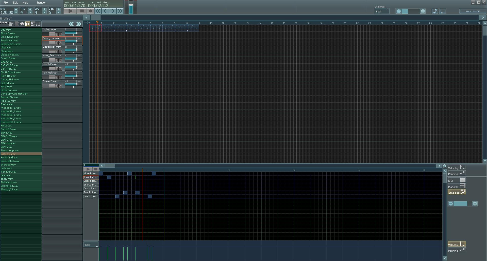

# Chaotic DAW

**Project Revival Notice**: Chaotic DAW was developed years ago but hasn't been actively used or marketed for a long time. This repository represents an attempt to revive and modernize the project with the help of AI assistance.

Chaotic is a lightweight, portable digital audio workstation designed for efficient music composition with minimal interface overhead. It combines a universal arranger with comprehensive MIDI sequencing, VST hosting, and built-in DSP tools.



## Features

### Universal Composition Arranger
- Single-track arranger that sequences text notes, bookmarks, instrument notes, automation envelopes, and patterns in one unified field
- Keyboard-driven workflow for rapid composition

### Pattern Types & Conversion
- **Piano Roll** – traditional MIDI note editing
- **Step Sequencer** – grid-based pattern programming
- **Text Pattern** – symbolic notation for quick entry
- **Pattern conversion** – freely convert between the three types

### Automation & Modulation
- Envelope automation for any parameter
- Real‑time automation recording
- **Effect symbols**: slide, vibrato, mute, reverse (samples), transpose, and more

### Autopatterns
- Instrument‑bound patterns triggered automatically with every note
- Enables sidechaining and complex modulation without manual placement

### Sampling & Instruments
- Built‑in sampler with looping, volume envelope, and basic sample editing
- Sample instruments treated as first‑class citizens

### Mixer & Routing
- 32 independent audio channels
- 3 send/aux channels
- 1 master channel

### Plugin Support
- **VST instruments** and **VST effects** hosting (VST2 compatible)
- Integrated VST browser and parameter mapping

### Built‑in Synthesis & Effects
- **Subtractive FM/RM synthesizer**
- **13 DSP effects** (reverb, delay, distortion, EQ, etc.)

### Rendering & Export
- Render to **WAV**, **OGG Vorbis**, and **FLAC**
- High‑quality offline bounce

### UI/UX Design
- Primary use of **linear sliders** over knobs for precise, fast parameter adjustment
- Minimalistic, keyboard‑centric interface
- **No loading time** – instant project startup

### Portability
- Entire application fits in a single directory
- Copy to USB flash drive and run on any Windows computer
- No installer or system‑wide dependencies required

## 🛠️ Build Instructions

The project uses CMake with MinGW‑w64 (Windows) or cross‑compilation from Linux.

```bash
cmake -B build -DCMAKE_TOOLCHAIN_FILE=mingw-toolchain.cmake
cmake --build build --config Release
```

See `CMakeLists.txt` for additional build options and required compile definitions.

## 📋 TODO / Future Improvements

- Replace embedded **JUCE 1.50 amalgamated source** with a git submodule pointing to [https://github.com/juce-framework/JUCE](https://github.com/juce-framework/JUCE)
---
*Chaotic DAW – achieve complex results with minimal interface friction.*
